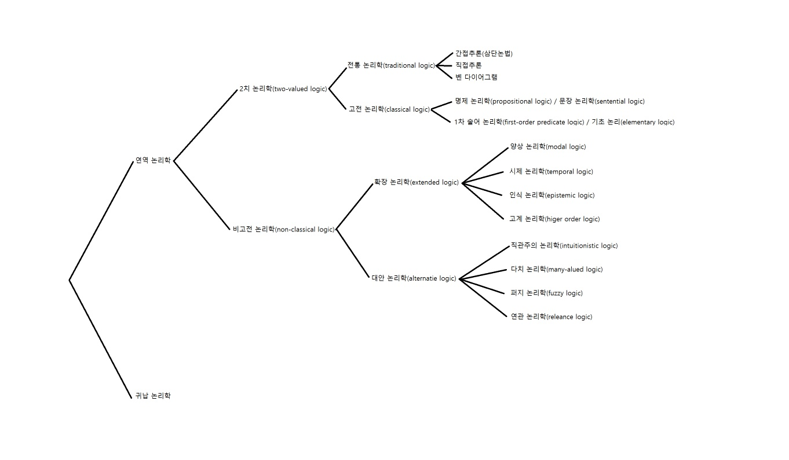

# 수리논리학과 집합론 개요

오늘은 수리논리학 글을 쌀 것이다.

수리논리가 뭘 하는 학문이냐 하면 수학에서 사용하는 논리를 연구하는 학문이기도 하고 논리라는 대상을 수학적으로 연구하는 학문이기도 하다. 다만 주제가 주제이다보니 수학 뿐만 아니라 철학에서도 중요하게 다루어지긴 한다. 둘이 굉장히 밀접한 연관이 있기도 하고 해서 완전히 철학을 분리하는 것은 쉽지 않고 나는 수학 냄새가 그나마 강한 분야만 다루겠다.

논리학이라는 학문은 아래와 같이 분류할 수 있는데 보다시피 굉장히 가지가 많고 복잡하다.

다만 수학을 하기 위해 가장 중요한 것은 **1차 논리**로 사실상 수학은 거의 이것을 토대로 하기 때문에 이것만 알아도 무방하다. 또한 다른 논리들도 기본적으로 1차 논리에 변형/제거/추가를 가한 것이다. 따라서 1차 논리만 안다면 필요할 때 금방 공부할 수 있다.

그러니 수리논리의 기초를 공부한다는 것은 1차 논리를 공부한다는 의미라고 보면 된다.

1차 논리는 아래와 같은 느낌의 논리를 다룬다.

> $P(x)\wedge Q(x)$ : $P(x)$이고 $Q(x)$이다.
> 
> $\forall x(P(x)\rightarrow Q(x))$ : 모든 $x$에 대해 $P(x)$이면 $Q(x)$이다.
>
> $\exists x(P(x)\lor Q(x))$ : $P(x)$ 또는 $Q(x)$인 $x$가 존재한다.
>
> $\neg P(x)$ : $P(x)$가 아니다.

본 적이 없으면 당황스러울 수도 있는데 별거 없고 $\forall x$는 임의의 $x$라는 의미, $\exists x$는 그러한 $x$가 존재한다는 의미, $\wedge, \lor, \rightarrow$는 각각 그리고, 또는 ~이면 ~이다의 의미, $\neg$는 ~가 아니다라는 의미이다. 그리고 일반적인 계산식과 동일하게 기본적으로 왼쪽에서 오른쪽으로 해석하되 괄호부터 해석한다.

> 1. 논리적인 문장을 어떻게 수학적인 대상으로 표현하는가?
> 2. 논리적인 문장의 의미는 어떻게 부여되는가?
> 3. 논리적인 문장들 사이에 어떤 관계가 있는가?

이때 1.의 내용을 **구문론(syntax)** 이라고 하며 2.의 내용은 **의미론(semantics)**, 그리고 3.의 내용은 관계에 대해 다루는 만큼 매우 폭넓은데 대표적으로 **도출(derivation)** 정도가 있다.

위의 3가지는 수리논리를 하기 위해 기초적으로 필요한 정의에 해당하는 내용이다. 이를 공부한 후에 본격적인 내용에 해당하는 **괴델의 완전성 정리**와 **계산 가능성(computability)**, 그리고 **괴델의 불완정성 정리** 에 대해 공부할 수 있게 된다.

다만 수학 특히 집합론을 보조하기 위해 공부하는 거라면 괴델의 정리들과 계산 가능성은 그게 무엇인지만 알아도 문제가 없다.

개요는 개요이므로 이정도면 됐고 다음은 집합론이 무얼 하는 녀석인지를 알아볼 것이다. 집합론은 집합을 연구하는 학문이다. 좀 더 좋은 표현은, 수학 전체를 포괄하는 공리계와, 아직 소개하지 않은 개념이지만, 모델에 대해 연구하는 학문이라고 말하는 것이다. 나중에 가면 무슨 의미인지 알게 될 터이니 넘어가겠다.

그렇지만 공리계와 모델을 본격적으로 만지기 전에, 현대에 표준으로 받아들여지는 공리계에 어떤 내용이 있고, 그것이 어떻게 수학 전체를 지탱하고 있는지에 대한 공부가 필요하다. 그 공부는 대략 다음과 같은 개요를 가진다.

> 1. ZFC 공리계에는 어떤 내용이 있는가?
> 2. 관계, 함수 등 기본적인 대상들은 어떻게 구성되는가?
> 3. 자연수, 정수, 유리수, 실수 등의 수 체계는 어떻게 구성되는가?
> 4. 순서, 특히 **정렬순서(well ordering)** 는 어떤 성질을 가지는가?
> 5. 집합의 크기는 어떻게 표현되는가?
> 6. 선택공리는 수학에서 어떤 역할을 하는가?

이것이 대략적인 기초 집합론의 내용이다. 이 뒤로는 공부를 더 해야 하는 부분이라 개요를 쓰지는 못하겠고 나중에 공부를 하게 된다면 올리도록 하겠다.

아래는 내가 참고한 수리논리와 집합론 교재들이다. 참고할 수 있으면 참고하자.

- open logic complete
  
  open logic project에서 작성한 수리논리학의 집대성이다. 인터넷에 무료로 배포되어 있으며 주의할 점은 정말로 수리논리학의 모든 내용이 담겨있다. 정독하는 것은 별로 좋은 생각은 아닌 것 같다. 알아서 하자.

- Set Theory, Thomas Jech 저
  
  현대 집합론의 표준, 집대성이다. 근데 대학원 표준이라 정말 어렵고 밥먹듯이 증명을 독자들에게 유기해서 진짜 쉽지 않다. 그래도 고급 집합론을 공부하고 싶다면 이만한 게 없다고 한다.

- Introduction to Set Theory, Karel Hrbacek, Thomas Jeck 공동 저
  
  개같이 어려운 위의 교재에 비해 훨씬 더 쉽고 상세하고 친절하다. 학부에서도 자주 쓰는 교재라 입문으로 상당히 좋다. 다만 내용의 밀도가 좀 높아서 마음에 안 들수도 있다.

이외에도 유명한 집합론 교재로는 Pinter의 집합론 교재나, 국문 교재인 계승혁 저 집합과 수의 체계 정도가 있다. 나는 읽지 않았으므로 알아서 알아보길 바란다.